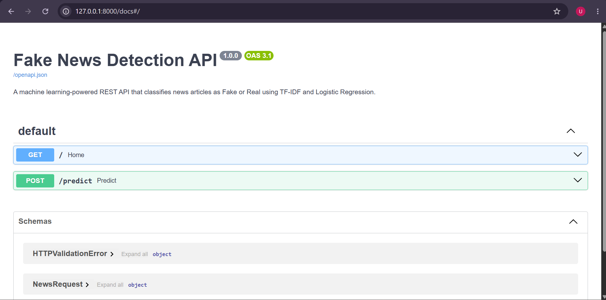
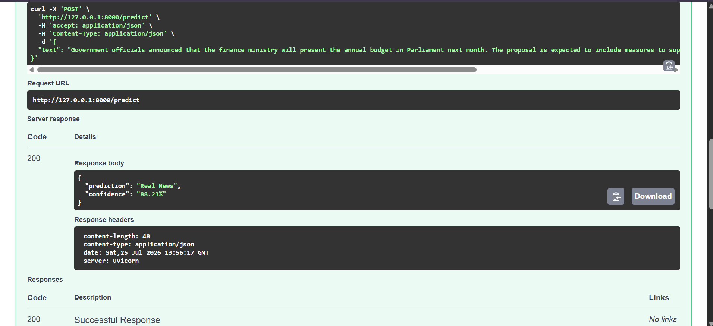
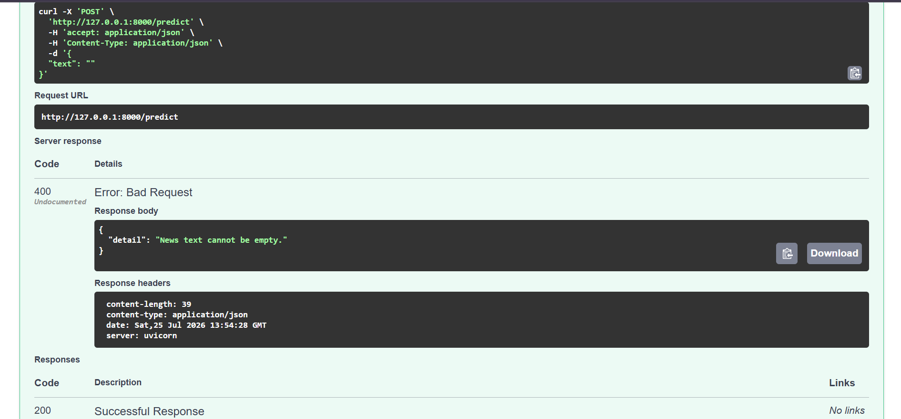
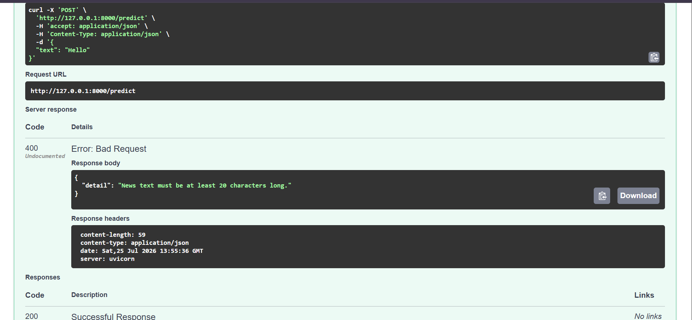

# 📰 Fake News Detection System

A machine learning-powered **Fake News Detection System** built using **Python, Scikit-learn, and FastAPI**.

The project classifies news articles as **Fake News** or **Real News** using a **TF-IDF Vectorizer** for feature extraction and a **Logistic Regression** classifier. The trained machine learning model is deployed through a FastAPI REST API that provides predictions along with confidence scores.

---

## 🚀 Features

* Data preprocessing and cleaning of fake and real news datasets
* Text feature extraction using TF-IDF Vectorization
* Machine learning classification using Logistic Regression
* Achieved approximately **98.6% test accuracy**
* Saved trained model and vectorizer using Joblib
* FastAPI REST API for real-time predictions
* Prediction confidence scores using `predict_proba()`
* Input validation and error handling
* Interactive API documentation using Swagger UI

---

## 🛠️ Tech Stack

### Programming Language

* Python 3.13

### Machine Learning

* Pandas
* NumPy
* Scikit-learn
* TF-IDF Vectorizer
* Logistic Regression
* Joblib

### Backend API

* FastAPI
* Uvicorn
* Pydantic

---

## 📂 Project Structure

```text
FakeNewsDetector/
│
├── app/
│   ├── main.py                 # FastAPI application
│   └── predictor.py            # Model loading and prediction logic
│
├── models/
│   ├── fake_news_model.pkl     # Trained Logistic Regression model
│   └── tfidf_vectorizer.pkl    # Saved TF-IDF vectorizer
│
├── screenshots/
│   ├── home.png
│   ├── real_prediction.png
│   ├── empty_input.png
│   └── short_input.png
│
├── training/
│   └── train.py                # Model training script
│
├── requirements.txt
├── README.md
└── .gitignore
```

---

# ⚙️ Installation

## 1. Clone the Repository

```bash
git clone https://github.com/UnnatiGoyal04/FakeNewsDetector.git

cd FakeNewsDetector
```

---

## 2. Create Virtual Environment

### Windows

```bash
python -m venv venv

venv\Scripts\activate
```

### macOS/Linux

```bash
python3 -m venv venv

source venv/bin/activate
```

---

## 3. Install Dependencies

```bash
pip install -r requirements.txt
```

---

# 📊 Dataset

The dataset files are not included in this repository because the original CSV files exceed GitHub's recommended file size limits.

The project uses:

* `Fake.csv`
* `True.csv`

from the Fake News Dataset.

To train the model:

1. Download the dataset.
2. Place the files inside:

```text
data/
│
├── Fake.csv
└── True.csv
```

3. Run:

```bash
python training/train.py
```

This will:

* Load and preprocess the dataset.
* Create TF-IDF features.
* Train the Logistic Regression model.
* Evaluate performance.
* Save:

```text
models/
├── fake_news_model.pkl
└── tfidf_vectorizer.pkl
```

---

# ▶️ Running the API

Start the FastAPI server:

```bash
uvicorn app.main:app --reload
```

The API will run at:

```text
http://127.0.0.1:8000
```

---

# 📖 API Documentation

Swagger UI:

```text
http://127.0.0.1:8000/docs
```

ReDoc:

```text
http://127.0.0.1:8000/redoc
```

---

# 📡 API Endpoints

## GET /

Checks whether the API is running.

### Response

```json
{
  "message": "Fake News Detection API is running!"
}
```

---

## POST /predict

Classifies a news article as Fake or Real.

### Request

```json
{
  "text": "The White House announced new sanctions targeting several foreign companies accused of violating international trade regulations."
}
```

### Response

```json
{
  "prediction": "Real News",
  "confidence": "92.41%"
}
```

---

# ❌ Input Validation

The API validates incoming requests before prediction.

## Empty Input

Request:

```json
{
  "text": ""
}
```

Response:

```json
{
  "detail": "News text cannot be empty."
}
```

---

## Short Input

Request:

```json
{
  "text": "Hello"
}
```

Response:

```json
{
  "detail": "News text must be at least 20 characters long."
}
```

---

# 📸 Screenshots

## Home Endpoint



## Successful Prediction



## Empty Input Validation



## Short Input Validation



---

# 📈 Model Performance

### Algorithm

Logistic Regression

### Feature Extraction

TF-IDF Vectorization

### Dataset Split

80% Training
20% Testing

### Accuracy

**98.59%**

### Classification Metrics

* Precision: ~0.99
* Recall: ~0.99
* F1-score: ~0.99

---

# ⚠️ Limitations

* The model is trained mainly on political and world news articles.
* Short or unrelated text may produce inaccurate predictions.
* The model identifies patterns in language rather than verifying facts.
* Confidence scores represent model certainty, not factual correctness.
* Performance depends heavily on the quality and diversity of training data.

---

# 💡 Future Improvements

Possible future enhancements:

* Deploy API using cloud platforms such as Render or Hugging Face Spaces
* Add Docker containerization
* Build a React or Streamlit frontend
* Train on larger and more diverse datasets
* Compare additional models such as Naive Bayes, SVM, or transformer-based models like BERT
* Add automated model retraining pipelines

---

# 📜 License

This project is created for educational and portfolio purposes.

